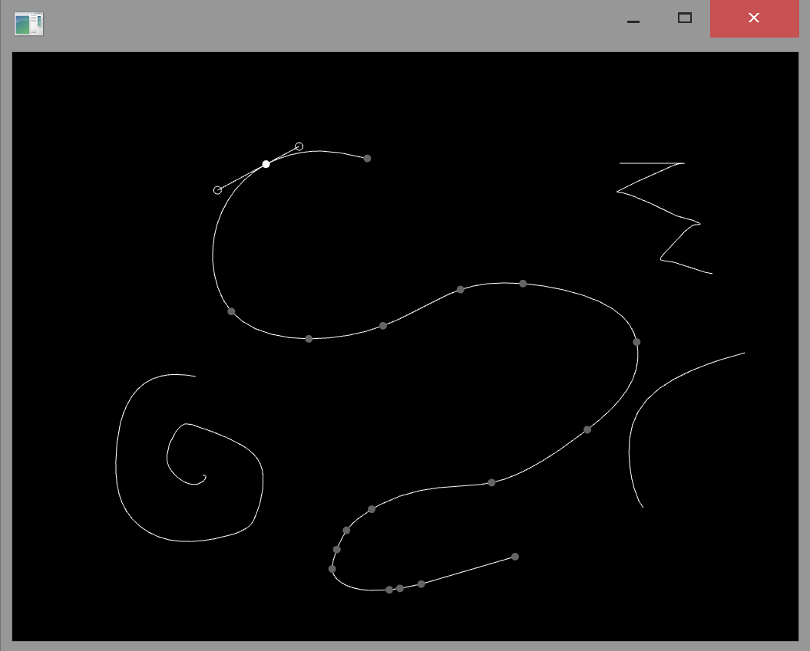

ofxPathFitter
=====================================

Introduction
------------
An OpenFrameworks addon for obtaining a Bezier curve through a set of points

Based on [Paper.js path simplification](http://paperjs.org/examples/path-simplification/)

Installation
------------
Just drop the folder into the `openFrameworks/addons/` folder.

Example
-------
See [SimpleVectorEditor](https://github.com/acmyu/SimpleVectorEditor), which uses this addon to simplify the lines that are drawn.

Usage
-----
    vector<ofPoint> vertices = line.getVertices(); // the set of points
    bool closed = false;
    double tolerance = 10;
    vector<BezPoint> bezier = ofxPathFitter::simplify(vertices, closed, tolerance); // creates the Bezier curve through the points

BezPoint contains 3 fields:

    ofPoint point; // the point
    ofPoint handleIn; // the first control point
    ofPoint handleOut // the second control point

Note: the control points contain the coordinates relative to the point. To get the absolute coordinates:

    BezPoint s = ofxPathFitter::handleAbsolute(bezier[i]);

or

    vector<BezPoint> bezierAbs = ofxPathFitter::handlesAbsolute(bezier);
