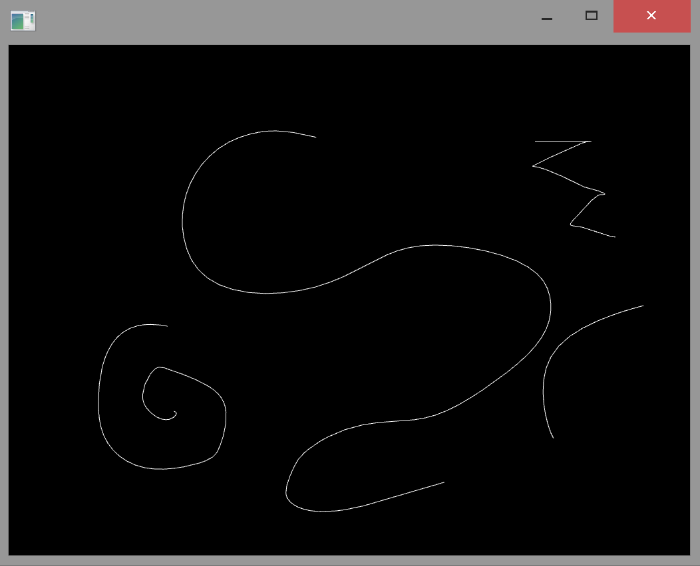
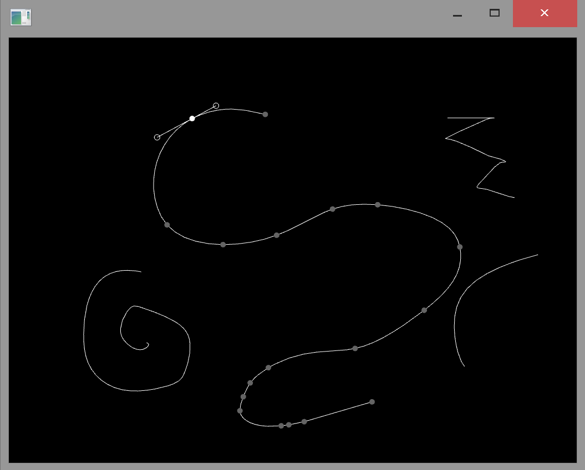

# SimpleVectorEditor
An OpenFrameworks app for drawing and editing smooth Bezier curves

# Usage

Press 'd' for drawing mode

- Drag mouse to draw a line

  
Press 'e' for editing mode

- Click on a line to edit the line
  
- Drag that line to move it
  
- Click on a point on that line to edit the point or its control points

  
Press 'x' to export to a .png in bin/data

Press 's' to save a .svg in bin/data
